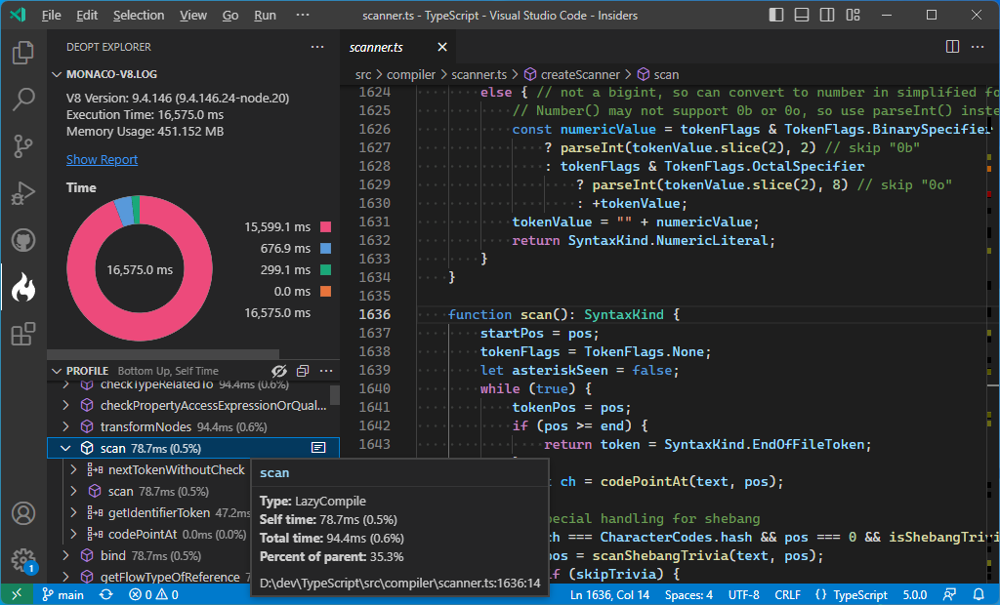
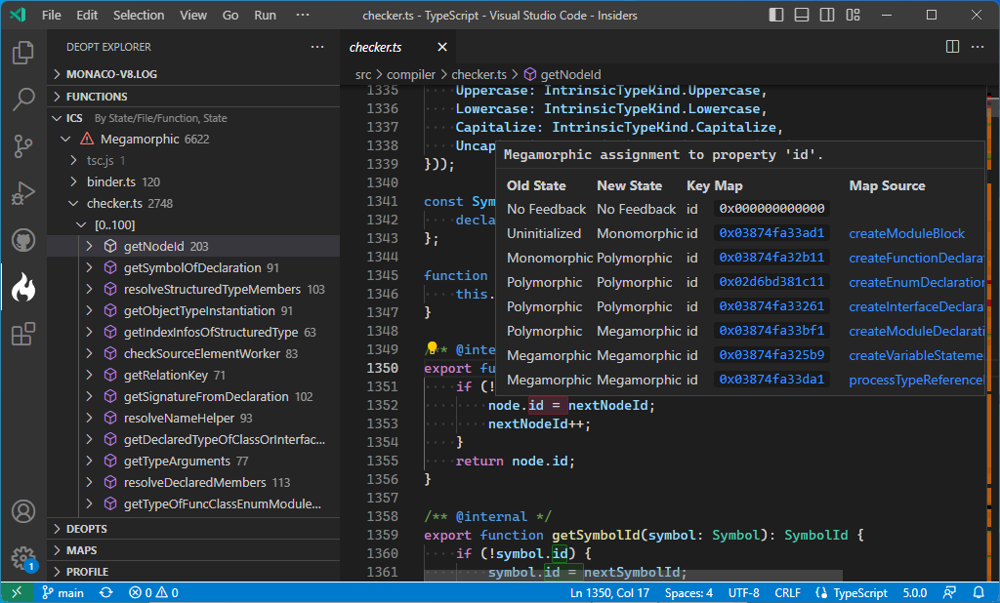
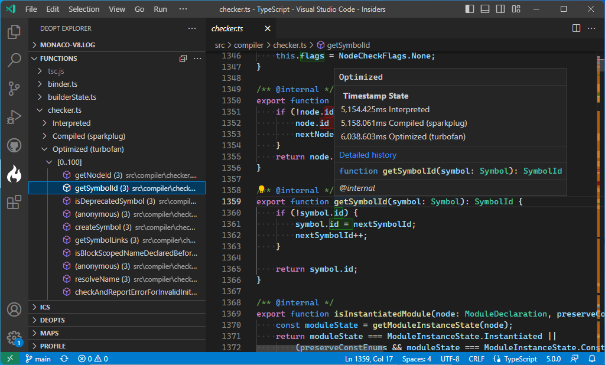

# deoptexplorer-vscode

A VS Code extension to inspect deoptimizations, ICs, function states, V8 maps,
and cpu profiling data for your JavaScript and TypeScript code running in V8
(i.e., Edge, Chrome, NodeJS, etc.).

## Overview

Deopt Explorer is a tool for visualizing V8 trace log information in VS Code.
This can give you insight into the inner workings of V8's optimizing compiler
that can be used to analyze your code to look for possible causes for
performance regressions. This tool is primarily designed for advanced users who
have an understanding of V8's internals. It does not provide recommendations for
performance improvements, but does give you access to information that you can
use to make informed decisions about the performance of your code.

The information provided by Deopt Explorer can be broken down into several
categories:

-   [CPU Profiles](#cpu-profiles) &mdash; Provides a tree view to view CPU
    profiling information.
-   [Inline Cache evolution](#inline-cache-evolution) &mdash; Inspect how an
    [Inline Cache][] evolves during execution.
-   [Deoptimizations](#deoptimizations) &mdash; View the kinds of
    deoptimizations that occured in a function.
-   [Function State](#function-state) &mdash; View whether a function was
    interpreted or compiled.
-   [Maps](#maps) &mdash; View the types of each object encountered by V8.

### CPU Profiles

Deopt Explorer can read trace file output from the `--prof` command line option
to provide a tree view that allows you to view _Top Down_ (Call Tree), _Bottom
Up_, and Flat views, similar to the Chrome Dev Tools:



### Inline Cache Evolution

Using the `ICS` tree view, you can navigate IC events and used editor
decorations and hover information to inspect how an [Inline Cache][] (IC)
evolves based on the types of values encountered by V8's interpreter and
optimizing compiler:



### Deoptimizations

Deopt Explorer provides information on when V8's optimizing compiler switches
back to the interpreter to collect type feedback that is used to patch a
function when different types are encountered:


### Function State

Deopt Explorer provides information on the state of a JavaScript function, such
as whether a function was executed enough times to be optimized by the
optimizing compiler, rather than being run purely in the interpreter:



### Maps

V8 keeps track of the layout of objects in memory in what is known as a "Map"
(not to be confused with the JavaScript `Map` object). This extension allows you
to view the various Maps encountered by an Inline Cache, and trace each property
in a Map back to the function that assigned it. This can allow you to
investigate and reduce unnecessary polymorphism in your code:


You can also peek at the maps associated with an [IC](#inline-caches) event:


## How to Use

Deopt Explorer gathers deoptimizations from a V8 log file you can generate from
the command line. The easiest way to generate a log compatible with your current
NodeJS install is to use [`dexnode`](#dexnode).

### `dexnode`

[`dexnode`](https://npmjs.com/package/dexnode) is a commandline utility
published on NPM. It wraps the existing `node` executable to provide the
commandline options necessary to generate a v8 log that can be consumed by Deopt
Explorer.

#### Installation

```sh
npm install --global dexnode
```

#### Examples

```sh
# NodeJS (via global install)
dexnode myscript.js

# NodeJS (via `npm exec`)
npm exec dexnode myscript.js

# Deno (via `deno run`)
deno run -A npm:dexnode myscript.js
```

#### Usage

```
dexnode [options] [--] <executable> [executable_options]
options:
  -h --help        print this message
     --no-maps     exclude v8 maps from log
     --no-ics      exclude ics from log
     --no-deopts   exclude deopts from log
     --no-profile  exclude cpu profile from log
     --no-sources  exclude sources from log
     --no-quiet    write dexnode messages to stdout (default)
     --maps        include v8 maps in log (default)
     --ics         include ics in log (default)
     --deopts      include deopts in log (default)
     --profile     include cpu profile in log (default)
     --sources     include sources in log (default)
     --quiet       do not write dexnode messages to stdout
     --out FILE    write all log output to FILE (default: isolate-<pid>-<isolate id>-v8.log)
     --            pass all remaining arguments to node
```

### NodeJS Commandline Options

You can also pass the requisite commandline options directly to the `node`
process. Since V8 is constantly evolving, the exact command line switches depend
on the version of V8, NodeJS, etc. Running with the requisite switches will
create an `isolate-<id>-v8.log` file in the current directory that can be
consumed by Deopt Explorer.

#### NodeJS 16+

```sh
node \
	--prof \
	--log-deopt \
	--log-ic \
	--log-maps \
	--log-maps-details \
	--log-internal-timer-events \
	--log-code \
	--log-source-code \
	--detailed-line-info \
	path/to/file.js
```

#### NodeJS 12.x, 14.x

```sh
node \
	--prof \
	--trace-ic \
	--trace-maps \
	--trace-maps-details \
	--log-internal-timer-events \
	--log-code \
	--log-source-code \
	--detailed-line-info \
	path/to/file.js
```

#### Options Overview

The options provided above have the following effects on the output log file,
which are leveraged by Deopt Explorer:

-   `--prof` &mdash; Writes statistical profiling information to the log
    (implies `--log-code`, see below).
    -   Deopt Explorer uses the profiling information to generate a navigable
        CPU profile and to generate graphs that indicate where time is spent
        during execution.
-   `--log-deopt` &mdash; Writes code deoptimization events to the log.
    -   Deopt Explorer uses this information to track and provide explanations
        for deoptimizations that happen during execution.
-   `--log-ic`/`--trace-ic` &mdash; Writes inline cache (IC) state transitions
    to the log.
    -   Deopt Explorer uses this information to track and provide explanations
        for the various optimizations and deoptimizations that happen during
        execution, such as when a function transitions from being "monomorphic"
        to becoming "polymorphic" due to differing inputs.
-   `--log-maps`/`--trace-maps` &mdash; Writes information about v8 "maps" (the
    internal representation of a JavaScript Object's structure and properties)
    to the log.
    -   Deopt Explorer uses this to provide detailed information about the
        various "maps" v8 encounters to help isolate differences in object shape
        that might cause inline cache misses and trigger recompilation
-   `--log-maps-details`/`--trace-maps-details` &mdash; Writes additional
    details about v8 "maps" to the log.
    -   Deopt Explorer provides this additional information when viewing a map.
-   `--log-internal-timer-events` &mdash; Writes internal V8 timer events to the
    log file.
    -   Deopt Explorer uses these events to generate graphs that indicate wheere
        time is spent during execution.
-   `--log-code` &mdash; Writes code events to the log file (automatically set
    if `--prof` is provided).
    -   Deopt Explorer uses this information to track function addresses and
        deoptimization bailouts.
-   `--log-source-code` &mdash; Writes the script ID, URL (or path), and source
    text for each script evaluated by V8.
    -   Deopt Explorer uses this information to get accurate line/column
        mappings for sources, and makes the log file portable to other machines
        for analysis.
    -   NOTE: This setting is _optional_. Deopt Explorer will attempt to resolve
        the source code from the file system for the scripts it encounters.
-   `--detailed-line-info` &mdash; Writes detailed line information to the log
    file for use with CPU profiling.
    -   Deopt Explorer uses this information to get accurate line/column
        mappings.

> NOTE: Some flags are not supported in all versions of v8/NodeJS. You may omit
> flags that are not available and Deopt Explorer will still work, though with
> reduced functionality.

In addition, you can customize the log file name and location using the
following options:

-   `--logfile="path/to/file.log"` - Sets the name of the output log file. If
    log files are generated per isolate (the default), an `isolate-<id>-` prefix
    will be prepended to the file name.
-   `--no-logfile-per-isolate` - Disables generation of a separate log file per
    isolate.

From within VS Code, execute the `Deopt Explorer: Open V8 Log` command. This
will add highlighting for various optimization hints in the related source code
files:

-   Highlighting and diagnostics for Eager, Lazy, Soft, and Debugger
    deoptimizations.
-   Highlighting for IC hints, such as polymorphic and megamorphic property
    access.
-   Highlighting for Optimization state for functions.

### Chromium (Chrome, MS Edge) Commandline Options

To use Deopt Explorer with Chrome, Edge, or other Chromium based browsers, you
must specify the `--no-sandbox` commandline option and encode the same V8
options from [Options Overview](#options-overview) as a comma-separated list
passed via the `--js-flags` option. For example:

```
chrome \
  --no-sandbox \
  --js-flags=--log-deopt,--log-ic,--log-maps,--log-maps-details,--log-internal-timer-events,--prof,... <URL>
```

It may be necessary to ensure all existing browser processes are closed before
launching the browser. On Android, it may also be necessary to specify the
`--single-process` option due to Android's sandboxing rules:

```
chrome \
  --no-sandbox \
  --single-process \
  --js-flags=--log-deopt,--log-ic,--log-maps,--log-maps-details,--log-internal-timer-events,--prof,... <URL>
```

## Caveats

V8 changes frequently in ways that can break this tool. While I try to keep this
up to date with engine releases, and support multiple versions of the engine, it
can be difficult for one person to keep on top of breaking changes. If you find
the extension is not working for you and you are using a more recent version of
NodeJS or the V8 engine, please file an issue. Log parsing failures should show
up in the Output Window for the "Deopt Explorer" extension.

<!--
## Color Customization

The following color customizations can be configured in your VS Code user or workspace settings under the `"workbench.colorCustomizations"` section:

- `deoptexplorer.uninitializedIc.background` - Background color for 'Uninitialized' V8 ICs
- `deoptexplorer.uninitializedIc.border` - Border color for 'Uninitialized' V8 ICs
- `deoptexplorer.uninitializedIc.overviewRuler` - Overview ruler color for 'Uninitialized' V8 ICs
- `deoptexplorer.premonomorphicIc.background` - Background color for 'Premonomorphic' V8 ICs
- `deoptexplorer.premonomorphicIc.border` - Border color for 'Premonomorphic' V8 ICs
- `deoptexplorer.premonomorphicIc.overviewRuler` - Overview ruler color for 'Premonomorphic' V8 ICs
- `deoptexplorer.monomorphicIc.background` - Background color for 'Monomorphic' V8 ICs
- `deoptexplorer.monomorphicIc.border` - Border color for 'Monomorphic' V8 ICs
- `deoptexplorer.monomorphicIc.overviewRuler` - Overview ruler color for 'Monomorphic' V8 ICs
- `deoptexplorer.polymorphicIc.background` - Background color for 'Polymorphic' V8 ICs
- `deoptexplorer.polymorphicIc.border` - Border color for 'Polymorphic' V8 ICs
- `deoptexplorer.polymorphicIc.overviewRuler` - Overview ruler color for 'Polymorphic' V8 ICs
- `deoptexplorer.recomputeHandlerIc.background` - Background color for 'Recompute Handler' V8 ICs
- `deoptexplorer.recomputeHandlerIc.border` - Border color for 'Recompute Handler' V8 ICs
- `deoptexplorer.recomputeHandlerIc.overviewRuler` - Overview ruler color for 'Recompute Handler' V8 ICs
- `deoptexplorer.megamorphicIc.background` - Background color for 'Megamorphic' V8 ICs
- `deoptexplorer.megamorphicIc.border` - Border color for 'Megamorphic' V8 ICs
- `deoptexplorer.megamorphicIc.overviewRuler` - Overview ruler color for 'Megamorphic' V8 ICs
- `deoptexplorer.genericIc.background` - Background color for 'Generic' V8 ICs
- `deoptexplorer.genericIc.border` - Border color for 'Generic' V8 ICs
- `deoptexplorer.genericIc.overviewRuler` - Overview ruler color for 'Generic' V8 ICs
- `deoptexplorer.softDeopt.background` - Background color for 'Soft' V8 Deoptimizations
- `deoptexplorer.softDeopt.border` - Border color for 'Soft' V8 Deoptimizations
- `deoptexplorer.softDeopt.overviewRuler` - Overview ruler color for 'Soft' V8 Deoptimizations
- `deoptexplorer.lazyDeopt.background` - Background color for 'Lazy' V8 Deoptimizations
- `deoptexplorer.lazyDeopt.border` - Border color for 'Lazy' V8 Deoptimizations
- `deoptexplorer.lazyDeopt.overviewRuler` - Overview ruler color for 'Lazy' V8 Deoptimizations
- `deoptexplorer.eagerDeopt.background` - Background color for 'Eager' V8 Deoptimizations
- `deoptexplorer.eagerDeopt.border` - Border color for 'Eager' V8 Deoptimizations
- `deoptexplorer.eagerDeopt.overviewRuler` - Overview ruler color for 'Eager' V8 Deoptimizations
- `deoptexplorer.compiledCode.background` - Background color for 'Compiled' V8 Code entries
- `deoptexplorer.compiledCode.overviewRuler` - Overview ruler color for 'Compiled' V8 Code entries
- `deoptexplorer.optimizableCode.background` - Background color for 'Optimizable' (ie. 'Interpreted') V8 Code entries
- `deoptexplorer.optimizableCode.overviewRuler` - Overview ruler color for 'Optimizable' (ie. 'Interpreted') V8 Code entries
- `deoptexplorer.optimizedCode.background` - Background color for 'Optimized' V8 Code entries
- `deoptexplorer.optimizedCode.overviewRuler` - Overview ruler color for 'Optimized' V8 Code entries
-->

<!--
## Release Notes

Users appreciate release notes as you update your extension.

### 1.0.0

Initial release of ...

### 1.0.1

Fixed issue #.

### 1.1.0

Added features X, Y, and Z.
-->

# License

Deopt Explorer is free and open-source software and is licensed under the
[MIT License](LICENSE).

## Third Party Licenses

Deopt Explorer was made possible by building on the works of other talented
engineers. You can find more information about the licenses for these projects
in [THIRD_PARTY_LICENSES](THIRD_PARTY_LICENSES). This includes:

-   V8 ([LICENSE.v8](LICENSE.v8))
-   Chromium ([LICENSE.chromium](LICENSE.chromium))
-   Visual Studio Code ([LICENSE.vscode](LICENSE.vscode))
-   Deoptigate ([LICENSE.deoptigate](LICENSE.deoptigate)), by Thorsten Lorenz
    (@thlorenz).

## Trademarks

This project may contain trademarks or logos for projects, products, or
services. Authorized use of Microsoft trademarks or logos is subject to and must
follow [Microsoft’s Trademark & Brand Guidelines][Trademark]. Use of Microsoft
trademarks or logos in modified versions of this project must not cause
confusion or imply Microsoft sponsorship. Any use of third-party trademarks or
logos are subject to those third-party’s policies.

[Inline Cache]: https://en.wikipedia.org/wiki/Inline_caching
[Trademark]:
	https://www.microsoft.com/en-us/legal/intellectualproperty/trademarks/usage/general
